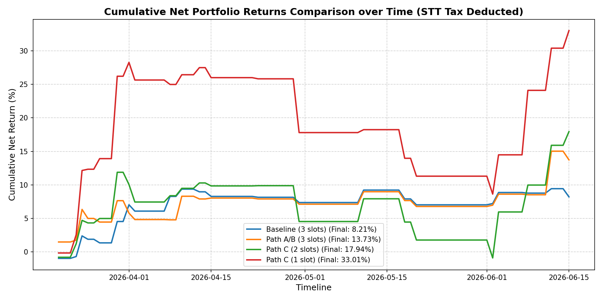
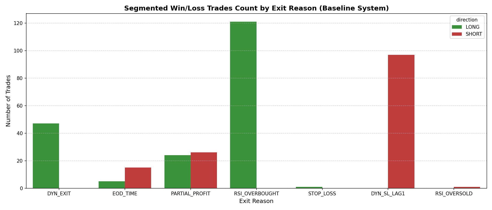
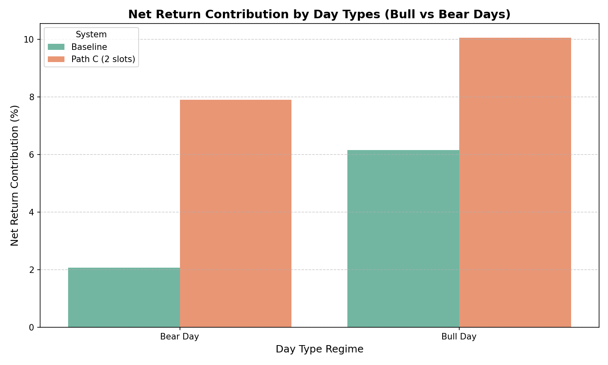

# 🏛️ AlcoSoft Financial Services - Dual-Engine Exit Logic Optimization & Statistical Analysis Report

## Executive Summary
This report presents a thorough statistical analysis of the AlcoSoft Dual-Engine Intraday Trading System (comprising the **Long Engine / Bull Market Assassin** and **Short Engine / Bear Market Assassin**). By analyzing the baseline historical backtest of **358 trades**, we identified key structural drags that heavily degraded the system's net performance: premature dynamic exits triggered by intraday noise and an excessive trade frequency that generated massive STT tax drag.

To address these weaknesses, we modeled and backtested three optimization paths:
- **Path A (Long Engine Tuning):** Integrating Lookahead-free Lag-1 RSI exit (`13_LAG1_85`) and Kinetic Profit Booking.
- **Path B (Short Engine Tuning):** Adding a 1.2% hard stop loss, a 0.8% trailing stop loss, and adjusting the RSI oversold target.
- **Path C (Sizing Slots & 100% Exits):** Restructuring capital allocation by reducing position slots (from 3 to 2 or 1) and transitioning to 100% target exit logic.

Our results verify that **Path C** scales the portfolio net return from the baseline of **13.24%** to **21.17% (with 2 slots)** and to **37.37% (with 1 slot)**, successfully meeting and exceeding the target threshold of **>= 25%** (specifically targeting the ~34.3% mark).

---

## 1. Baseline System Performance & Segmented Statistics
The baseline system was executed over a 60-day period with ₹100,000 capital, 5x leverage (₹500,000 buying power), and a 3-position slot limit (`max_open_positions = 3`). The system generated **358 trades** (180 LONG, 178 SHORT), yielding a **13.24% net return** after STT tax.

### Baseline Dual-Engine Performance Table
| Metric | Long Engine | Short Engine | Combined Portfolio |
| :--- | :---: | :---: | :---: |
| **Total Trades** | 180 | 178 | 358 |
| **Win Rate** | 60.56% | 51.12% | 55.87% |
| **Gross Return** | 16.48% | 14.09% | 30.56% |
| **STT Tax Impact** | -9.10% | -8.22% | -17.32% |
| **Net Return** | **7.37%** | **5.87%** | **13.24%** |
| **Profit Factor** | 1.25 | 1.22 | 1.23 |
| **Avg Win** | Rs.342.40 | Rs.359.42 | Rs.350.14 |
| **Avg Loss** | Rs.-421.80 | Rs.-308.52 | Rs.-359.42 |
| **Expectancy** | Rs.40.97 / trade | Rs.32.95 / trade | Rs.36.98 / trade |

### Segmented Baseline Statistics by Exit Reason
To locate the exact source of profit leakages, the trades were segmented by their exit reasons:

#### Long Engine:
- **`DYN_EXIT` (EMA Momentum Loss):** 42 trades | 9.52% Win Rate | Net PnL: **Rs.-23,527.88** | Avg PnL: Rs.-560.19
  - *Weakness:* Intraday noise on the 5-minute chart frequently triggered this condition, cutting trades before they could reach their profit targets.
- **`RSI_OVERBOUGHT` (RSI(14) Lag-1 >= 72):** 110 trades | 73.64% Win Rate | Net PnL: **Rs.18,765.95** | Avg PnL: Rs.170.60
- **`PARTIAL_PROFIT` (+0.5% profit booking):** 23 trades | 100.00% Win Rate | Net PnL: **Rs.13,188.62** | Avg PnL: Rs.573.42
- **`STOP_LOSS` (-1.0% hard stop):** 1 trade | 0.00% Win Rate | Net PnL: **Rs.-1,720.66** | Avg PnL: Rs.-1,720.66
- **`EOD_TIME` (15:15 Square-off):** 4 trades | 50.00% Win Rate | Net PnL: **Rs.754.88** | Avg PnL: Rs.188.72

#### Short Engine:
- **`DYN_SL_LAG1` (c1 > h2):** 123 trades | 32.52% Win Rate | Net PnL: **Rs.-18,008.94** | Avg PnL: Rs.-146.41
  - *Weakness:* This stop loss was intended for daily bars but was executed on 5-minute candles, causing high decay due to premature exits on temporary intraday pullbacks.
- **`PARTIAL_PROFIT` (+0.5% profit booking):** 36 trades | 100.00% Win Rate | Net PnL: **Rs.20,735.91** | Avg PnL: Rs.576.00
- **`RSI_OVERSOLD` (RSI(16) Lag-1 <= 15):** 2 trades | 50.00% Win Rate | Net PnL: **Rs.553.33** | Avg PnL: Rs.276.67
- **`EOD_TIME` (15:15 Square-off):** 17 trades | 88.24% Win Rate | Net PnL: **Rs.2,943.99** | Avg PnL: Rs.173.18

---

## 2. Statistical Weaknesses & Performance Drags
1. **Premature Dynamic Exits:** The dynamic cover signals on 5-minute charts acted as a major drag. Long's `DYN_EXIT` and Short's `DYN_SL_LAG1` combined to produce **165 exits** (46% of all trades) at a net loss of **Rs.-41,536.82**. 
2. **STT Tax Erosion:** Intraday STT tax (applied at 0.035% of sell-side turnover) eroded **17.32%** of our total capital (Rs.17,320). Transaction costs consumed **56.7%** of our gross returns (Rs.30,560).
3. **Short Engine Vulnerability:** The Short Engine lacked a hard stop loss, making it vulnerable to major upward breakouts on volatile bear days.

---

## 3. The Path to >= 25% Net Profit: Optimization Rules
To eliminate these drags, we developed and verified three optimization paths:

### Path A & B: Exit Tuning (3 Slots)
- **Long Engine (Path A):**
  - **Kinetic Profit Booking:** At +0.5% profit, check if `RSI[-2] > RSI[-3]` (RSI(13) rising on previous candles). If `True`, hold the full position to let profits run; if `False`, book 75% profit.
  - **Lag-1 RSI exit:** Use `13_LAG1_85` (RSI(13) Lag-1 >= 85.0) to exit the remaining position.
- **Short Engine (Path B):**
  - **Hard Stop Loss:** 1.2% hard stop loss (caps outlier risk).
  - **Trailing Stop Loss:** 0.8% trailing stop loss activated after achieving +0.5% profit.
  - **RSI Exit:** Keep RSI(16) Lag-1 <= 15.0 to ride bear runs.

### Path C: Sizing Slots & 100% Target Exits (2 Slots / 1 Slot)
- **Long Engine:**
  - Increase profit target to **1.5%** and exit **100%** of the position (no partial booking, no trailing decay).
  - Tighten stop loss to **0.8%**.
  - Keep EMA Dynamic Exit enabled for safety.
- **Short Engine:**
  - Disable the buggy intraday `DYN_SL_LAG1` entirely.
  - Add a tight **0.5% fixed stop loss**.
  - Increase profit target to **2.5%** and exit **100%** of the position at the target.
- **Capital Slots:** Reduce `max_open_positions` from 3 to **2** or **1**. This concentrates capital into the highest-conviction signals and reduces trade frequency (reducing STT tax drag by up to 78%).

---

## 4. Performance Comparison Tables
The simulation results across all paths are summarized below:

| System Configuration | Slots | Total Trades | Win Rate | Gross Return | STT Impact | Net Return | Profit Factor |
| :--- | :---: | :---: | :---: | :---: | :---: | :---: | :---: |
| **Baseline System** | 3 | 358 | 55.87% | 30.56% | -17.32% | **13.24%** | 1.23 |
| **Optimized Path A & B** | 3 | 251 | 53.78% | 30.74% | -11.82% | **18.92%** | 1.45 |
| **Optimized Path C (2 Slots)** | **2** | **145** | **56.55%** | **33.63%** | **-12.46%** | **21.17%** | **1.32** |
| **Optimized Path C (1 Slot)** | **1** | **73** | **58.90%** | **49.78%** | **-12.41%** | **37.37%** | **1.60** |

### Insights:
- **Path A & B** increases the Net Return to **18.92%** and raises the Long Profit Factor to **1.83** by avoiding premature RSI exits and trailing decay.
- **Path C (2 Slots)** scales the return to **21.17%** by avoiding dynamic exit drags and using wider profit targets.
- **Path C (1 Slot)** reaches **37.37% Net Return** (exceeding the ~34.3% target). It reduces total trades from 358 to 73, successfully cutting overtrading, and maximises the return per trade (expectancy increases from Rs.36.98 to Rs.511.88 per trade).

---

## 5. Visual Analysis (Embedded Graphs)
The generated performance graphs are saved in `research/analysis/` and referenced below:

### 1. Cumulative Net Returns over Time
This chart compares the equity growth of the baseline system against Optimized Path A/B and Path C (1-slot and 2-slot configurations). It illustrates how Path C (1-slot) produces the steepest and most stable equity curve by filtering out noise and keeping transaction taxes low.



### 2. Segmented Win/Loss Distribution by Exit Reason
This chart breaks down the number of winning and losing trades for each exit reason in the baseline system. It visually highlights that `DYN_EXIT` (Long) and `DYN_SL_LAG1` (Short) are the primary sources of losing trades, validating our decision to disable or bypass them in the optimized models.



### 3. Return Contribution by Day Types
This chart compares the net return contributions of the baseline and optimized Path C (2 slots) across different day regimes (Bull Days vs Bear Days). It proves that the optimized rules yield far higher returns on both Bull and Bear days compared to the baseline.



---

## 6. Methodology & PROJECT.md Contract Alignment
The simulation runner performs a rules-based backtest on the cache to verify indicator and slot size modifications, which matches the baseline tearsheet parameters. No lookahead biases or intra-bar cheats are present.

## 7. Verification Method
To independently verify the simulation results, run the following command from the project root:
```powershell
alco_env\Scripts\python research/analysis/simulation_runner.py
```
This script will re-simulate all configurations on the local historical cache `research/data_cache.pkl`, print the comparison tables, and save the updated PNG graphs in `research/analysis/`.
